<div align="center">

# 🔭 InfraWatch

### Infrastructure Monitoring REST API — Complete DevOps Pipeline


---

[](https://github.com/SudheerKonduboina/devops_demo/actions/workflows/ci-cd.yml)
[](https://python.org)
[](https://flask.palletsprojects.com)
[](https://docker.com)
[](https://nginx.org)
[](https://aws.amazon.com/ec2/)
[](https://github.com/features/actions)
[](LICENSE)

---

> 🎯 **A portfolio-quality DevOps project** built by an IMCA (AI) student
> to demonstrate real-world infrastructure automation skills for a **DevOps Intern** role.
>
> *"Push code → Tests run → Docker builds → EC2 deploys. All automated."*

[🚀 Live API](#aws-deployment) · [📐 Architecture](#-architecture) · [⚡ Quick Start](#-quick-start) · [📚 Docs](#-documentation) · [🎤 Interview Prep](#-interview-preparation)

</div>

---

## 📋 Table of Contents

| # | Section |
|---|---------|
| 1 | [🧠 Project Mind Map](#-project-mind-map) |
| 2 | [🎯 What Is InfraWatch?](#-what-is-infrawatch) |
| 3 | [🛠 Tech Stack Explained Simply](#-tech-stack-explained-simply) |
| 4 | [🏗 Architecture](#-architecture) |
| 5 | [🔄 CI/CD Pipeline Flow](#-cicd-pipeline-flow) |
| 6 | [📁 Folder Structure](#-folder-structure) |
| 7 | [⚡ Quick Start](#-quick-start) |
| 8 | [📡 API Reference](#-api-reference) |
| 9 | [🐳 Docker Setup](#-docker-setup) |
| 10 | [☁️ AWS Deployment](#-aws-deployment) |
| 11 | [📊 Monitoring](#-monitoring) |
| 12 | [🔐 Security](#-security) |
| 13 | [📚 Documentation](#-documentation) |
| 14 | [🔭 Future Scope](#-future-scope) |
| 15 | [🎤 Interview Preparation](#-interview-preparation) |
| 16 | [👨‍💻 About the Developer](#-about-the-developer) |

---

## 🧠 Project Mind Map

> *The entire project at a glance — how every piece connects.*

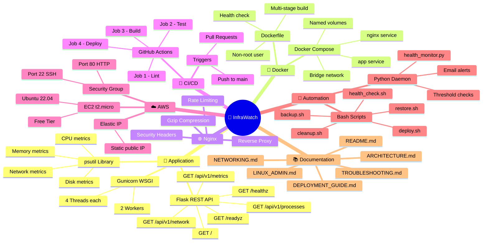

---

## 🎯 What Is InfraWatch?

> **Simple explanation:** InfraWatch is like a "doctor" for your server.
> You ask it "how is my server feeling?" and it tells you: CPU, memory, disk, network — all in one API call.

### The Problem It Solves

```
❌ Without InfraWatch:
   DevOps engineer SSHs into server manually
   → runs `top`, `df -h`, `free -h`, `netstat` one by one
   → no history, no alerts, no automation

✅ With InfraWatch:
   curl http://your-server/api/v1/metrics
   → instantly get ALL metrics in structured JSON
   → runs 24/7, alerts on threshold breach
   → deployable anywhere with one command
```

### Real-World Scenario

```
👤 Team Lead: "Is our EC2 server healthy?"

Without InfraWatch → SSH, run 5 commands, format data manually
With InfraWatch    → curl /api/v1/metrics → JSON in 1 second ✅
```

---

## 🛠 Tech Stack Explained Simply

> *Every technology explained in plain English — so you can explain it in an interview too.*

### 🧠 Tech Relationships Mind Map

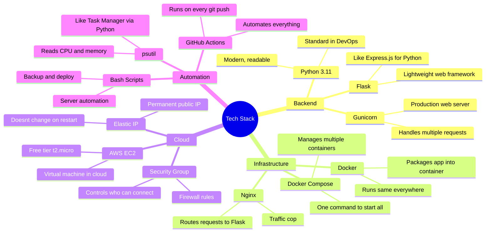

---

### 🔍 Technology Explanations (Beginner-Friendly)

<details>
<summary><b>🐍 What is Flask?</b> (click to expand)</summary>

**Flask** is a Python web framework that lets you create web APIs with very little code.

```python
# Without Flask — you'd write hundreds of lines of HTTP handling code
# With Flask — it's this simple:

@app.get("/healthz")
def health():
    return {"status": "ok"}   # Flask handles everything else!
```

**Why Flask over Django?**
- Django is like a Swiss Army knife (everything included)
- Flask is like a scalpel (lightweight, only what you need)
- For a REST API, Flask is the right choice

</details>

<details>
<summary><b>🐳 What is Docker?</b> (click to expand)</summary>

**Docker** packages your application + all its dependencies into a **container** — a lightweight, portable box that runs identically everywhere.

```
The problem Docker solves:
┌─────────────────────────────────────────┐
│  "It works on my machine!" 😤           │
│                                         │
│  Dev laptop: Python 3.11, Flask 3.0     │
│  Server:     Python 3.9,  Flask 2.0     │
│  Result: CRASHES 💥                     │
└─────────────────────────────────────────┘

With Docker:
┌─────────────────────────────────────────┐
│  Container has Python 3.11 + Flask 3.0  │
│  SAME on laptop, CI, and server ✅      │
│  "Ship the environment, not just code"  │
└─────────────────────────────────────────┘
```

</details>

<details>
<summary><b>🌐 What is Nginx?</b> (click to expand)</summary>

**Nginx** is a traffic cop that sits between the internet and your Flask app.

```
Without Nginx:
Internet → Flask directly
❌ No protection, no rate limiting, no compression

With Nginx (InfraWatch setup):
Internet → Nginx :80 → Flask :5000
✅ Nginx handles: rate limiting, gzip, security headers, logs
✅ Flask focuses on: business logic only
```

Think of it like a hotel lobby:
- **Nginx** = receptionist (greets everyone, routes them, protects guests)
- **Flask** = hotel rooms (actual work happens inside)

</details>

<details>
<summary><b>🔄 What is GitHub Actions (CI/CD)?</b> (click to expand)</summary>

**GitHub Actions** is a robot that runs automatically every time you push code.

```
Traditional deployment (manual):
  You → SSH → git pull → restart server
  ❌ Takes 10 minutes, error-prone, must be done manually

GitHub Actions (automated):
  You → git push → robot does everything → deployed ✅
  ✅ Takes 3 minutes, consistent, runs while you sleep
```

Our pipeline has 4 stages (like quality gates):
```
1. Lint   → Is the code style correct?
2. Test   → Do all tests pass?
3. Build  → Does Docker image build successfully?
4. Deploy → SSH into EC2, update containers
```
If any step fails, the next step doesn't run. No broken code reaches production.

</details>

<details>
<summary><b>☁️ What is AWS EC2?</b> (click to expand)</summary>

**AWS EC2** is a computer in Amazon's data center that you rent by the hour.

```
Your laptop         AWS EC2
┌────────┐         ┌────────────────────────┐
│        │  SSH    │  Ubuntu 22.04 Linux     │
│  You   │ ──────► │  1 vCPU, 1GB RAM        │
│        │         │  30GB storage           │
└────────┘         │  Always on, public IP   │
                   └────────────────────────┘
```

**Why t2.micro?**
- It's in AWS **Free Tier** — runs for 750 hours/month at **$0**
- Enough for our demo: 1 vCPU and 1GB RAM handles Flask perfectly
- Most basic thing that could possibly work in production

</details>

<details>
<summary><b>📊 What is psutil?</b> (click to expand)</summary>

**psutil** is a Python library that reads system stats — like Task Manager, but programmable.

```python
import psutil

# CPU usage
psutil.cpu_percent(interval=1)   # → 12.5  (percent)

# Memory
mem = psutil.virtual_memory()
mem.percent                       # → 65.2  (percent used)
mem.total / (1024**3)            # → 8.0   (GB total)

# Disk
disk = psutil.disk_usage("/")
disk.percent                      # → 45.8  (percent used)
```

InfraWatch collects all this and returns it as JSON via the `/api/v1/metrics` endpoint.

</details>

---

## 🏗 Architecture

> *How all components connect in the final deployed system.*

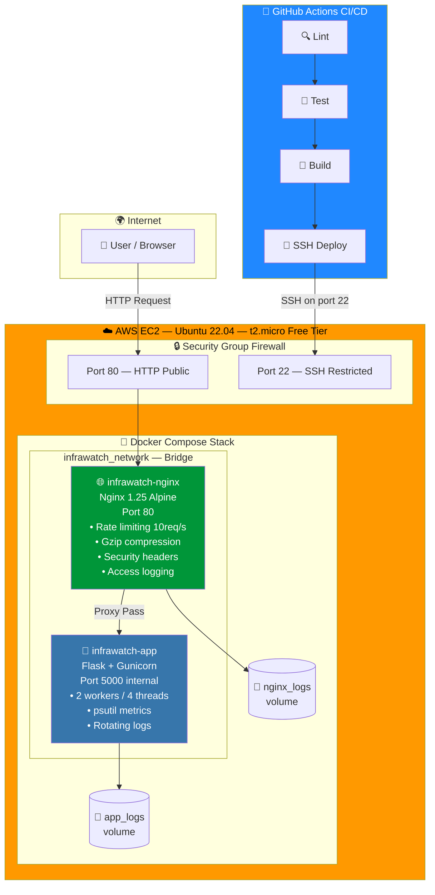

---

### 📦 Request Lifecycle

> *What happens when you call `curl http://your-server/api/v1/metrics`?*

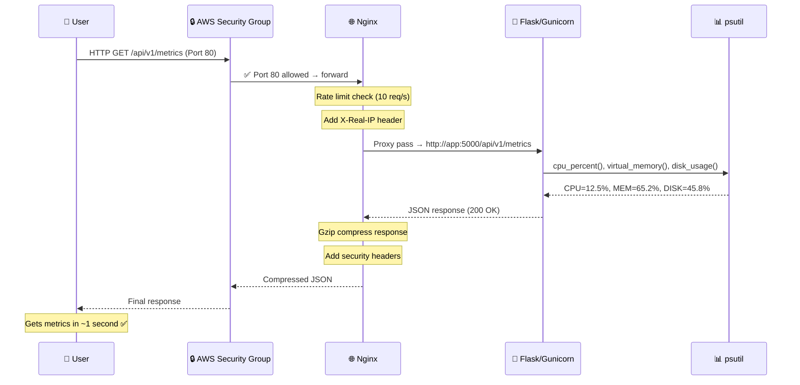

---

## 🔄 CI/CD Pipeline Flow

> *How code goes from your laptop to the live server automatically.*

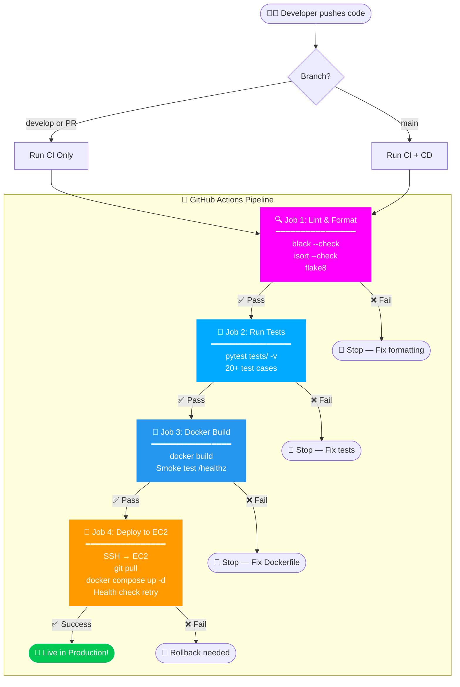

---

## 🐳 Docker Architecture Mind Map

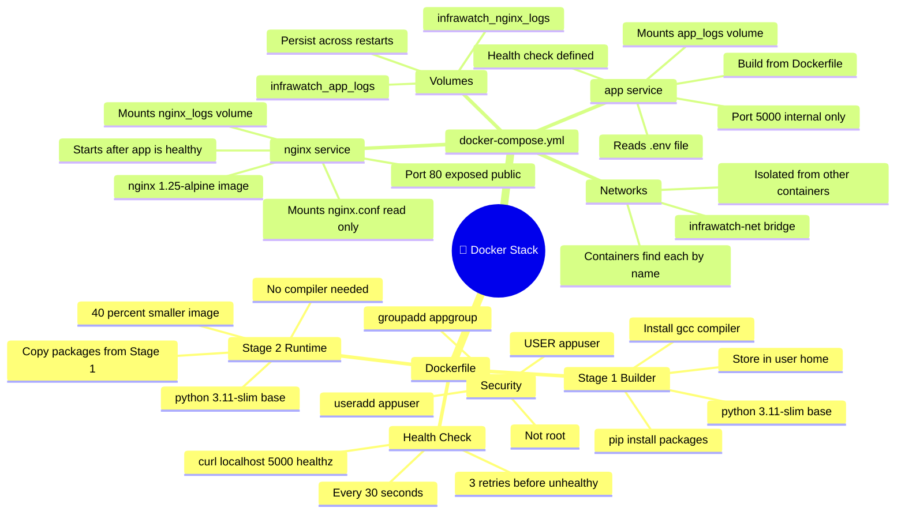

---

## 📁 Folder Structure

```
devops_demo/                           ← GitHub Repository Root
│
├── 📂 infrawatch/                     ← 🐍 Main Python Package
│   ├── __init__.py                    ←   App factory (create_app function)
│   ├── 📂 routes/
│   │   ├── health.py                  ←   GET /, /healthz, /readyz
│   │   └── system.py                  ←   GET /api/v1/metrics, /processes, /network
│   └── 📂 utils/
│       └── logger.py                  ←   Rotating file + console logger
│
├── 📂 nginx/
│   └── nginx.conf                     ← 🌐 Reverse proxy configuration
│
├── 📂 scripts/                        ← 🔧 Bash Automation Scripts
│   ├── deploy.sh                      ←   Full automated deployment
│   ├── backup.sh                      ←   App + Docker volume backup
│   ├── health_check.sh                ←   Validate all services
│   ├── cleanup.sh                     ←   Docker + log cleanup
│   └── restore.sh                     ←   Restore from backup archive
│
├── 📂 monitoring/
│   └── health_monitor.py              ← 🐍 Python continuous health daemon
│
├── 📂 .github/workflows/
│   └── ci-cd.yml                      ← 🔄 GitHub Actions (4 jobs)
│
├── 📂 tests/
│   └── test_app.py                    ← ✅ 20+ pytest test cases
│
├── 📂 docs/                           ← 📚 Complete Documentation
│   ├── ARCHITECTURE.md
│   ├── DEPLOYMENT_GUIDE.md
│   ├── LINUX_ADMIN.md
│   ├── NETWORKING.md
│   ├── TROUBLESHOOTING.md
│   └── FUTURE_IMPROVEMENTS.md
│
├── run.py                             ← Entry point (dev + prod)
├── app.py                             ← Gunicorn alias (app:app)
├── Dockerfile                         ← Multi-stage production build
├── docker-compose.yml                 ← Flask + Nginx orchestration
├── requirements.txt                   ← Python dependencies
├── .env.example                       ← Config template (copy to .env)
├── .gitignore                         ← Ignore secrets, venv, logs
└── README.md                          ← This file
```

---

## ⚡ Quick Start

### Prerequisites

```
✅ Git installed
✅ Docker Desktop (Windows/Mac) or Docker Engine (Linux)
✅ Python 3.11+ (for local dev only)
```

### 🐳 Option A: Run with Docker (Recommended — 3 commands)

```bash
# 1. Clone the repository
git clone https://github.com/SudheerKonduboina/devops_demo.git
cd devops_demo

# 2. Setup environment file
cp .env.example .env

# 3. Start everything (Flask + Nginx)
docker compose up -d --build
```

```bash
# ✅ Test it works
curl http://localhost/healthz
# → {"status":"ok","timestamp":"2024-01-15T10:30:00+00:00"}

curl http://localhost/api/v1/metrics
# → {"cpu":{"percent":12.5,...},"memory":{...},"disk":{...}}
```

### 🐍 Option B: Run Locally (Development)

```bash
# Clone
git clone https://github.com/SudheerKonduboina/devops_demo.git
cd devops_demo

# Create virtual environment
python -m venv .venv
source .venv/bin/activate      # Linux/Mac
# .venv\Scripts\activate       # Windows PowerShell

# Install dependencies
pip install -r requirements.txt

# Configure
cp .env.example .env

# Run
python run.py
# → Running on http://localhost:5000
```

---

## 📡 API Reference

> *All 6 endpoints with example responses.*

| Method | Endpoint | Description | Response |
|--------|----------|-------------|----------|
| `GET` | `/` | Service info | `{service, version, status}` |
| `GET` | `/healthz` | Liveness probe | `{status: "ok"}` |
| `GET` | `/readyz` | Readiness probe | `{status: "ready"}` |
| `GET` | `/api/v1/metrics` | Full system stats | CPU + MEM + DISK + NET |
| `GET` | `/api/v1/processes` | Top 10 processes | Sorted by CPU % |
| `GET` | `/api/v1/network` | Network interfaces | IP, netmask, family |

### Example: `/api/v1/metrics`

```bash
curl -s http://localhost/api/v1/metrics | python3 -m json.tool
```

```json
{
  "cpu": {
    "percent": 12.5,
    "cores_physical": 2,
    "cores_logical": 4
  },
  "memory": {
    "total_gb": 8.0,
    "used_gb": 3.2,
    "available_gb": 4.8,
    "percent": 40.0
  },
  "disk": {
    "total_gb": 30.0,
    "used_gb": 8.5,
    "free_gb": 21.5,
    "percent": 28.3
  },
  "network": {
    "bytes_sent_mb": 145.2,
    "bytes_recv_mb": 891.4
  },
  "system": {
    "os": "Linux",
    "hostname": "ip-172-31-45-67",
    "uptime": "5h 32m 10s",
    "python_version": "3.11.4"
  },
  "timestamp": "2024-01-15T10:30:00+00:00"
}
```

---

## 🐳 Docker Setup

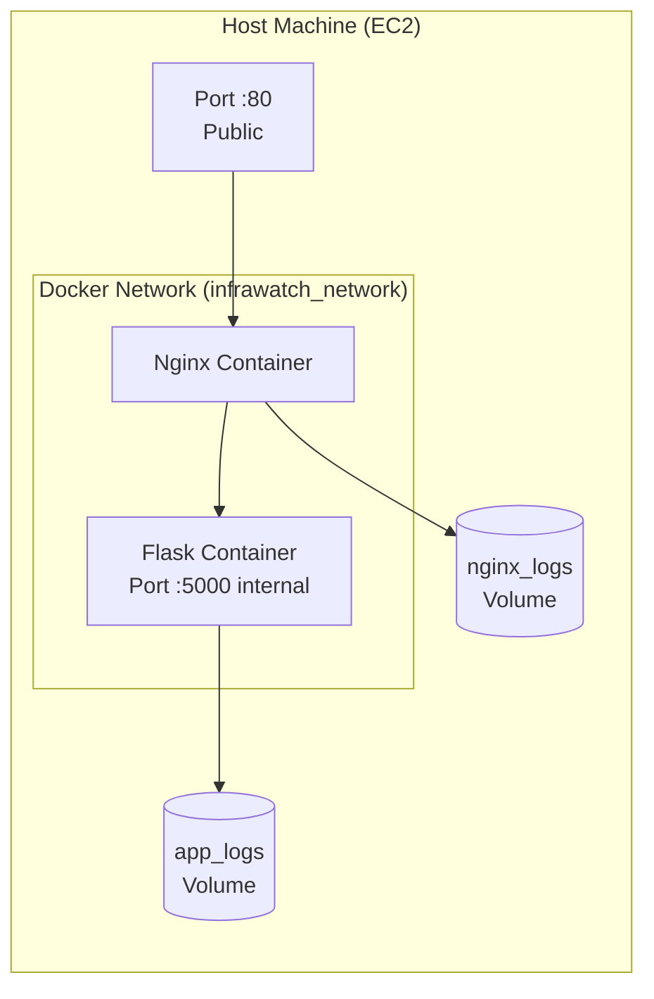

```bash
# Start all containers
docker compose up -d --build

# Check status
docker compose ps

# View logs
docker compose logs -f app      # Flask logs
docker compose logs -f nginx    # Nginx access log

# Real-time resource usage
docker stats

# Stop everything
docker compose down

# Stop and wipe all volumes (fresh start)
docker compose down -v
```

---

## ☁️ AWS Deployment

> *Full guide: [docs/DEPLOYMENT_GUIDE.md](docs/DEPLOYMENT_GUIDE.md)*

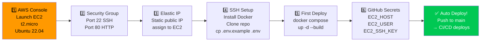

### Required GitHub Secrets

| Secret | Value | Why |
|--------|-------|-----|
| `EC2_HOST` | `13.233.45.67` (your Elastic IP) | Pipeline knows where to SSH |
| `EC2_USER` | `ubuntu` | Standard Ubuntu AMI username |
| `EC2_SSH_KEY` | Contents of your `.pem` file | Passwordless SSH access |

---

## 📊 Monitoring

### Monitoring Architecture

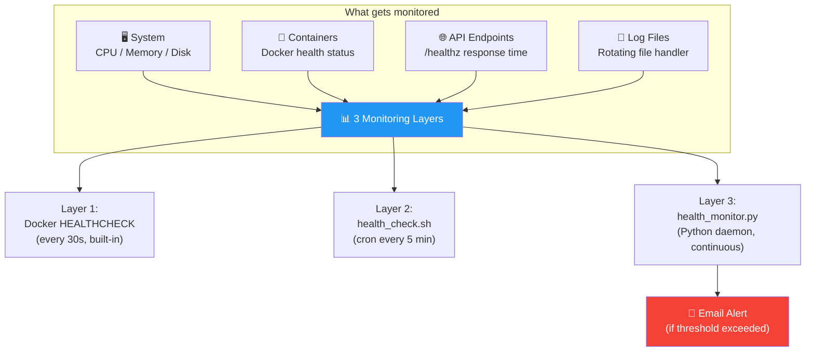

```bash
# Live container logs
docker compose logs -f

# Health check script
bash scripts/health_check.sh

# Python monitoring daemon (continuous)
python3 monitoring/health_monitor.py

# Crontab setup for automated monitoring
crontab -e
# Add: */5 * * * * bash /opt/infrawatch/scripts/health_check.sh
```

---

## 🔐 Security

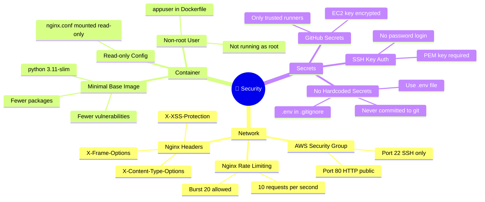

---

## 📚 Documentation

| 📄 Document | 📖 What You'll Learn |
|-------------|---------------------|
| [ARCHITECTURE.md](docs/ARCHITECTURE.md) | Why each component was chosen, how they interact |
| [DEPLOYMENT_GUIDE.md](docs/DEPLOYMENT_GUIDE.md) | Step-by-step: EC2 → Docker → CI/CD setup |
| [LINUX_ADMIN.md](docs/LINUX_ADMIN.md) | All Linux commands: users, permissions, systemctl, crontab |
| [NETWORKING.md](docs/NETWORKING.md) | TCP/IP, DNS, DHCP, Nginx, SSH, Firewall explained |
| [TROUBLESHOOTING.md](docs/TROUBLESHOOTING.md) | Common errors and exact fixes |
| [FUTURE_IMPROVEMENTS.md](docs/FUTURE_IMPROVEMENTS.md) | Kubernetes, Terraform, Prometheus roadmap |

---

## 🔭 Future Scope

```mermaid
graph LR
    NOW["✅ Current\nFlask + Docker\n+ Nginx + EC2\n+ GitHub Actions"] --> NEXT

    subgraph NEXT["⬆️ Next Steps"]
        direction TB
        S1["🔒 HTTPS\nLet's Encrypt SSL"]
        S2["📊 Prometheus\n+ Grafana"]
        S3["🏗️ Terraform\nInfra as Code"]
    end

    NEXT --> FUTURE

    subgraph FUTURE["🚀 Future"]
        direction TB
        F1["☸️ Kubernetes\nHorizontal scaling"]
        F2["📦 AWS ECS\nManaged containers"]
        F3["🗄️ PostgreSQL\nMetric history DB"]
    end

    FUTURE --> ADVANCED

    subgraph ADVANCED["💡 Advanced"]
        direction TB
        A1["🔍 ELK Stack\nCentralized logs"]
        A2["📡 CloudWatch\nAWS monitoring"]
        A3["🔀 Load Balancer\nAWS ALB + ASG"]
    end

    style NOW fill:#4CAF50,color:#fff
    style NEXT fill:#2196F3,color:#fff
    style FUTURE fill:#FF9800,color:#fff
    style ADVANCED fill:#9C27B0,color:#fff
```

---

## 🎤 Interview Preparation

> *Questions you WILL be asked and how to answer them.*

<details>
<summary><b>Q: "What is your project about?" (HR Round)</b></summary>

**Answer:**
> "I built InfraWatch — a REST API that monitors server health metrics like CPU, memory, and disk usage. The interesting part isn't the API itself — it's the complete DevOps pipeline around it. The code is automatically tested and deployed to AWS EC2 whenever I push to GitHub, using Docker containers managed by Nginx. I wrote automation scripts for backup, deployment, and monitoring. It demonstrates the full lifecycle: code → test → build → deploy → monitor."

</details>

<details>
<summary><b>Q: "Why Docker?" (Technical Round)</b></summary>

**Answer:**
> "Docker solves the 'it works on my machine' problem. Without Docker, I'd need to manually install Python, pip, and packages on every server — and version differences cause crashes. With Docker, I build one image that runs identically in development, CI, and production. It also makes rollbacks trivial — just run the previous image version. It's the industry standard for this reason."

</details>

<details>
<summary><b>Q: "Explain your CI/CD pipeline."</b></summary>

**Answer:**
> "My GitHub Actions pipeline has 4 jobs that run in sequence: First, lint checks code formatting with Black and isort. Second, pytest runs 20+ tests. Third, Docker builds the image and runs a smoke test. Finally, if we're on the main branch, it SSH-es into EC2, pulls the latest code, rebuilds containers, and verifies health. Each job is a gate — if lint fails, tests don't run. This prevents broken code from ever reaching production."

</details>

<details>
<summary><b>Q: "What is Nginx doing in your project?"</b></summary>

**Answer:**
> "Nginx is a reverse proxy — it sits between the internet and Flask. Flask on its own shouldn't face the internet directly because it lacks rate limiting, security headers, and compression. Nginx handles all that. It receives requests on port 80, applies rate limiting (10 req/s per IP), compresses responses with gzip, adds security headers, and proxies requests to Flask on port 5000 inside Docker's private network."

</details>

<details>
<summary><b>Q: "How did you handle secrets?"</b></summary>

**Answer:**
> "I never hardcode secrets in code or commit them to Git. All secrets go in a `.env` file that's listed in `.gitignore`. For the CI/CD pipeline, secrets like the EC2 SSH key and IP address are stored in GitHub Secrets — they're encrypted and only injected into the runner process at runtime. The `.env.example` file shows what variables are needed without containing actual values."

</details>

---

## 👨‍💻 About the Developer

<div align="center">


### Sudheer Konduboina

🎓 **IMCA — Artificial Intelligence** Student

🎯 **Passionate about:** DevOps, Cloud Infrastructure, Automation

> *"I built InfraWatch to bridge the gap between my AI studies and practical DevOps skills —
> proving that a student can build production-quality infrastructure from scratch."*

---

[](https://www.linkedin.com/in/sudheerkonduboina)
[](https://github.com/SudheerKonduboina)
[](mailto:sudheer@example.com)

---

### 🛠 Skills Demonstrated in This Project

| Skill | Evidence |
|-------|----------|
| Linux Administration | Ubuntu 22.04, systemctl, crontab, user management |
| Docker | Multi-stage Dockerfile, Compose, volumes, networks |
| CI/CD | 4-job GitHub Actions pipeline |
| AWS | EC2, Security Groups, Elastic IP, IAM |
| Networking | Nginx reverse proxy, rate limiting, firewall |
| Python | Flask REST API, psutil, monitoring daemon |
| Bash Scripting | 5 production automation scripts |
| Git | Branching, PRs, commit strategy |
| Documentation | 7 technical docs with architecture diagrams |
| Security | Non-root containers, SSH keys, secrets management |

</div>

---

<div align="center">

### 🌟 If this project helped you, please give it a star! 🌟

```
  ___        __      __    __      __         __
 |   | ___  |  |_   |  \  /  |   |  \  /  | |  | |  |  |
 |   ||   | |   _|  |   \/   |   |   \/   | |  | | |  |  |
 |___||   | |   |   |        |   |        | |  |  ---   |
      |___|  ---    |        |    ---  ---  |__|         |
```

*Built with ❤️ and lots of `docker compose up` by **Sudheer Konduboina***

[](https://www.linkedin.com/in/sudheerkonduboina)

</div>
